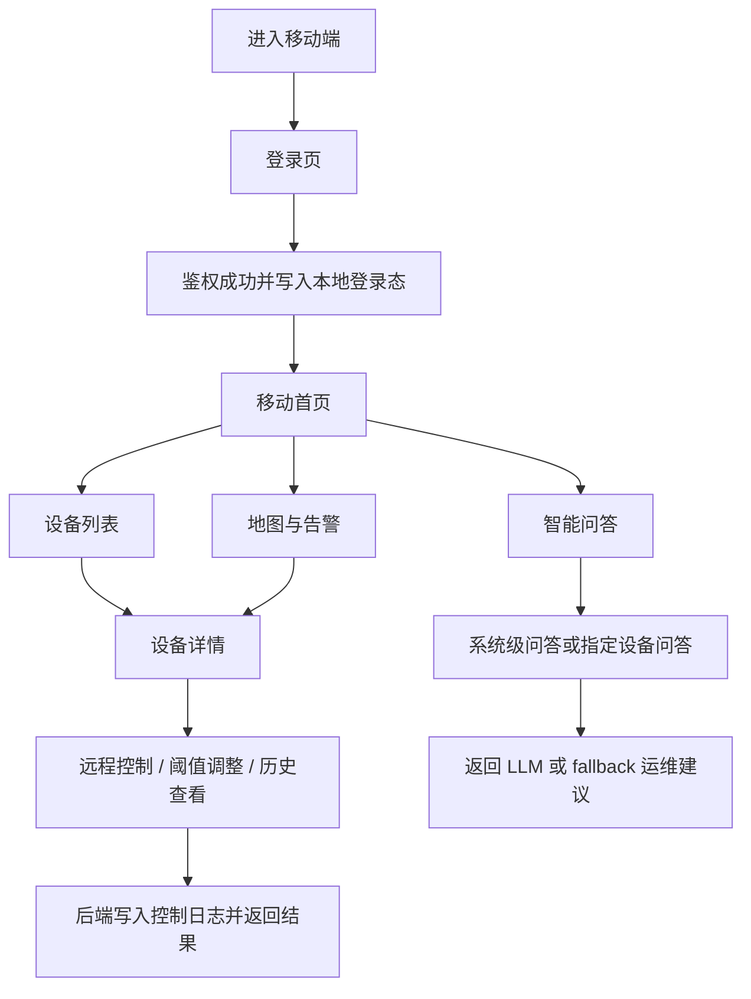

## 1. 产品概述
为“智慧路灯节能系统”新增一套独立的移动端 H5 运维前端，面向值班人员、巡检人员和管理员，支持在手机上完成登录、查看设备、处理告警、远程控制和智能问答。
- 核心目标是复用现有 FastAPI + MySQL + MQTT 后端能力，形成“管理端大屏 + 硬件联调端 + 移动运维端”的完整三端协同体系。
- 产品价值在于提升现场响应速度、增强展示完整性，并为后续封装为 PWA 或小程序提供清晰前端边界。

## 2. 核心功能

### 2.1 用户角色
| 角色 | 登录方式 | 核心权限 |
|------|----------|----------|
| 管理员 | 用户名密码登录 | 查看全部数据、设备建档、阈值配置、远程控制、告警处理、用户查看、智能问答 |
| 运维人员 | 用户名密码登录 | 查看首页、设备、地图、实时光照、告警、远程控制、智能问答 |
| 访客/查看者 | 用户名密码登录 | 只读查看首页、设备状态、地图分布、历史趋势、智能问答 |

### 2.2 功能模块
1. **登录页**：账号密码登录、登录态恢复、过期自动跳转、角色路由分发。
2. **移动首页**：设备总数、在线离线、未处理告警、当前开灯、重点设备趋势、最近告警、快捷入口。
3. **设备列表页**：搜索、状态筛选、卡片列表、下拉刷新、设备详情跳转、批量入口提示。
4. **设备详情页**：设备基础信息、实时光照、阈值状态、控制按钮、历史趋势、命令记录、告警记录。
5. **地图与告警页**：移动地图查看设备分布、告警筛选、告警处理、离线设备快速定位。
6. **智能问答页**：系统级提问、指定设备提问、快捷问题、回答记录、失败兜底提示。
7. **我的页**：当前账号信息、角色说明、主题切换、退出登录、版本信息。

### 2.3 页面详情
| 页面名称 | 模块名称 | 功能说明 |
|-----------|-------------|---------------------|
| 登录页 | 登录表单 | 输入用户名和密码，提交后保存 JWT，支持无效/过期 token 自动清理 |
| 登录页 | 登录反馈 | 展示登录中、错误提示、默认演示账号说明 |
| 移动首页 | 概览指标区 | 展示设备总数、在线数量、离线数量、未处理告警、开灯数量 |
| 移动首页 | 重点设备卡片 | 展示重点设备状态、最近心跳、最近光照、快捷进入详情 |
| 移动首页 | 快捷功能宫格 | 设备列表、地图、告警、智能问答、实时光照等快捷入口 |
| 移动首页 | 趋势与告警流 | 展示重点设备趋势图和最近告警流，便于移动端快速浏览 |
| 设备列表页 | 搜索与筛选 | 按设备编号、名称、位置、状态筛选 |
| 设备列表页 | 设备卡片 | 展示设备状态、灯具状态、位置、心跳时间、光照值和快捷操作 |
| 设备详情页 | 设备头部概览 | 展示编号、名称、在线状态、灯具状态、位置、最近心跳 |
| 设备详情页 | 实时监测 | 展示当前光照、阈值建议、最近更新时间 |
| 设备详情页 | 远程控制 | 管理员/运维人员可执行开灯、关灯、亮度调整和阈值修改 |
| 设备详情页 | 历史与日志 | 展示历史曲线、命令记录、告警记录 |
| 地图页 | 设备地图 | 基于高德地图展示设备分布、在线状态、点击查看详情 |
| 地图页 | 离线筛选 | 快速筛选离线设备和缺坐标设备提示 |
| 告警页 | 告警列表 | 按时间和处理状态查看告警，支持处理操作 |
| 告警页 | 告警详情抽屉 | 展示告警类型、级别、设备、处理结果和建议动作 |
| 智能问答页 | 对话面板 | 发送运维问题、选择设备范围、查看 AI/规则版回答 |
| 智能问答页 | 快捷问题 | 内置演示问题，适配答辩与现场展示 |
| 我的页 | 账号中心 | 展示用户名、角色、当前环境、主题切换、退出登录 |

## 3. 核心流程
用户打开移动端后进入登录页，登录成功后进入首页；首页可继续跳转到设备、地图、告警和智能问答。设备详情页是移动端的核心操作页，承担状态查看、趋势查询、远程控制和告警排查。移动端整体强调“单手操作、少层级跳转、关键数据直达”。

## 4. 用户界面设计
### 4.1 设计风格
- 主色：深海军蓝 `#09111f`、图层深灰蓝 `#111c2d`
- 强调色：青蓝电光 `#36d7ff`、告警橙 `#ff9b3d`、成功绿 `#2dd4a3`
- 按钮风格：大圆角、发光描边、主操作高亮填充、次操作半透明描边
- 字体：标题使用更有科技感的中文黑体风格，正文使用清晰易读的现代无衬线字体
- 布局风格：移动优先的分层卡片、吸底导航、悬浮操作按钮、顶部状态栏
- 图标建议：线性图标搭配高亮状态点，风格与当前管理端“科技控制台”保持一致

### 4.2 页面设计概览
| 页面名称 | 模块名称 | UI 元素 |
|-----------|-------------|-------------|
| 登录页 | 品牌头图 | 夜景路灯背景、渐变蒙层、品牌标题、发光按钮、极简表单 |
| 移动首页 | 概览卡片区 | 2 列统计卡片、柔和发光边框、状态色数字、短说明文字 |
| 移动首页 | 快捷功能区 | 宫格图标、轻动效、点击反馈、吸附滚动 |
| 设备列表页 | 筛选工具条 | 吸顶搜索、状态切换胶囊、下拉刷新反馈 |
| 设备列表页 | 设备卡片 | 状态点、光照数值、心跳时间、控制按钮、进入详情箭头 |
| 设备详情页 | 头部信息区 | 设备编号、状态徽标、地图位置、快捷操作按钮 |
| 设备详情页 | 趋势模块 | 迷你折线图、卡片分段标题、滚动日志列表 |
| 地图页 | 地图容器 | 全屏地图、底部信息抽屉、设备状态图例 |
| 告警页 | 告警卡片流 | 告警级别色条、处理按钮、时间线布局 |
| 智能问答页 | 聊天气泡 | 深色面板、AI 发光头像、快捷问题胶囊、输入框吸底 |
| 我的页 | 个人中心 | 账号卡片、角色说明、主题切换、退出按钮 |

### 4.3 响应式策略
- 采用移动优先设计，首要适配 `360px` 到 `430px` 宽度区间
- 支持 iPhone 与主流安卓安全区适配，处理刘海屏和底部手势区域
- 顶部信息简化，核心导航放入底部 Tab Bar
- 列表、图表、地图和表单均以触摸优先，按钮尺寸不低于 `44px`
- 平板宽度下自动切换为双栏卡片布局，但视觉语言保持一致

### 4.4 3D / 动效指引
- 不使用重型 3D 场景，避免移动端性能负担
- 首页使用轻量级渐变背景、光斑、粒子与卡片入场动效制造科技氛围
- 图表与卡片优先使用 CSS 与 Canvas 级别动效，控制首屏渲染成本
- 地图页允许局部高亮动画，但避免过多持续性 GPU 特效
