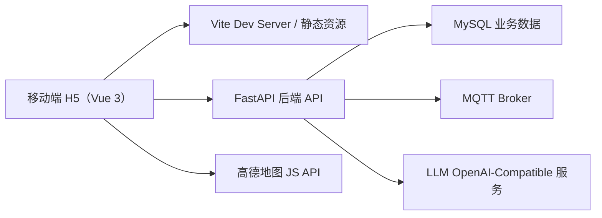
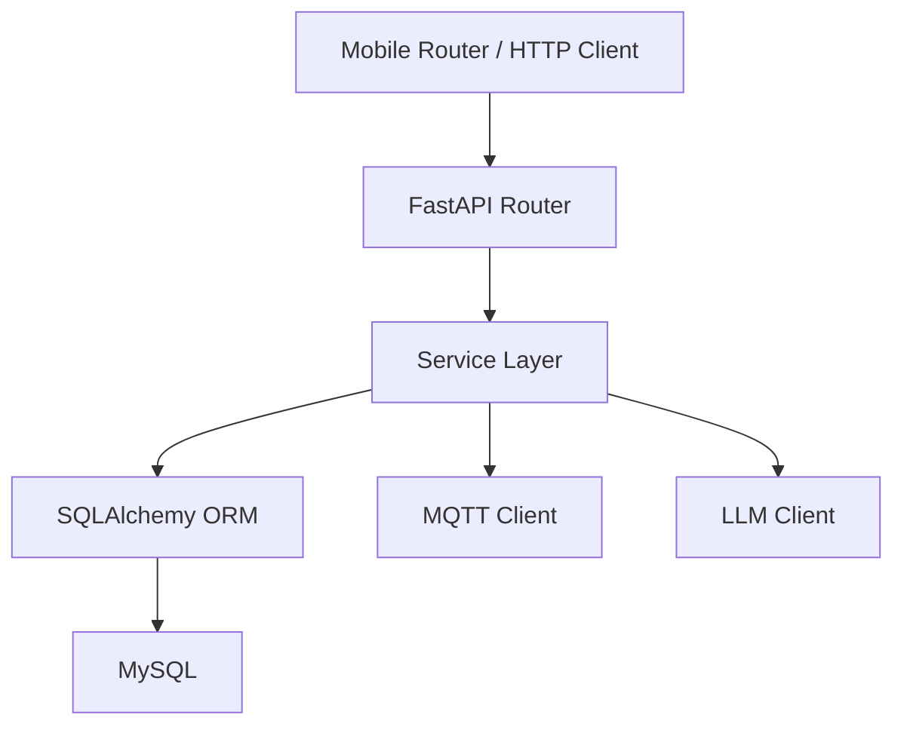
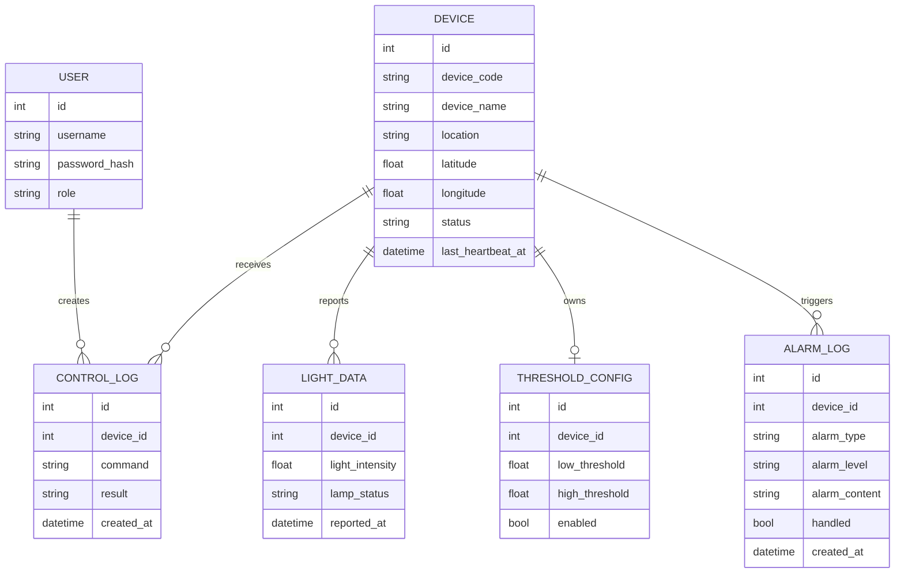

## 1. 架构设计



移动端前端作为独立子项目接入现有后端，不新增独立业务后端。后端继续负责鉴权、设备管理、光照查询、阈值配置、告警处理、远程控制和智能问答，移动端仅做适配和移动交互重构。

## 2. 技术说明
- 前端：Vue 3 + TypeScript + Vite + Vue Router
- 状态管理：Pinia（集中管理登录态、首页摘要、设备列表缓存）
- 样式体系：CSS Variables + Scoped CSS + 轻量原子类约定，沉淀移动端设计 Token
- 网络层：Fetch 封装，请求拦截、401 自动回登录、统一错误消息处理
- 图表：ECharts
- 地图：高德地图 JS API（延续现有地图能力）
- 交互增强：`@vueuse/core`
- 可安装能力：`vite-plugin-pwa`
- 初始化方式：在仓库根目录新增独立项目 `mobile-frontend`
- 后端：复用现有 FastAPI 项目，不单独新建移动端服务

## 3. 路由定义
| 路由 | 用途 |
|-------|---------|
| `/login` | 登录页，完成鉴权和登录态恢复 |
| `/` | 移动首页，展示概览、快捷入口、重点设备、最近告警 |
| `/devices` | 设备列表页，支持搜索、筛选、下拉刷新 |
| `/devices/:id` | 设备详情页，查看状态、趋势、阈值、告警和控制入口 |
| `/map` | 移动地图页，展示设备分布和离线定位 |
| `/alarms` | 告警中心，查看与处理告警 |
| `/agent` | 智能问答页，支持系统级与指定设备提问 |
| `/profile` | 我的页，展示账户信息、主题设置和退出登录 |

## 4. API 定义

### 4.1 TypeScript 类型定义
```ts
interface MobileAuthSession {
  token: string;
  user: {
    id: number;
    username: string;
    role: "admin" | "operator" | "viewer";
  };
}

interface MobileDeviceCard {
  id: number;
  deviceCode: string;
  deviceName: string;
  location: string;
  latitude?: number;
  longitude?: number;
  status: "online" | "offline";
  lampStatus: "ON" | "OFF";
  lightIntensity?: number;
  lastHeartbeatAt: string;
}

interface MobileAlarmItem {
  id: number;
  deviceId: number;
  deviceCode: string;
  alarmType: string;
  alarmLevel: "INFO" | "WARN" | "CRITICAL";
  alarmContent: string;
  handled: boolean;
  createdAt: string;
}
```

### 4.2 主要接口
| 接口 | 方法 | 用途 |
|------|------|------|
| `/api/auth/login` | `POST` | 用户登录 |
| `/api/auth/me` | `GET` | 获取当前用户信息 |
| `/api/devices` | `GET` | 获取设备列表 |
| `/api/devices/{id}` | `GET` | 获取设备详情 |
| `/api/devices/{id}/latest-light` | `GET` | 获取设备最新光照 |
| `/api/devices/{id}/light-history` | `GET` | 获取设备历史光照 |
| `/api/devices/{id}/threshold` | `GET/PUT` | 查询或更新阈值 |
| `/api/devices/{id}/commands` | `GET/POST` | 查询控制记录或下发控制命令 |
| `/api/devices/commands/batch` | `POST` | 批量控制 |
| `/api/alarms` | `GET` | 获取告警列表 |
| `/api/alarms/{id}/handle` | `PUT` | 处理告警 |
| `/api/agent/chat` | `POST` | 智能问答 |

### 4.3 移动端新增聚合建议
- 首版优先复用现有接口，不强制新增后端接口
- 如首页首屏并发压力较大，可后续补充 `/api/mobile/home` 聚合接口
- 如设备详情加载时间较长，可后续补充 `/api/mobile/devices/{id}/overview` 聚合接口

## 5. 服务端架构图



## 6. 数据模型

### 6.1 数据模型定义


### 6.2 数据定义语言
```sql
CREATE TABLE users (
  id INT PRIMARY KEY AUTO_INCREMENT,
  username VARCHAR(64) NOT NULL UNIQUE,
  password_hash VARCHAR(255) NOT NULL,
  role VARCHAR(32) NOT NULL
);

CREATE TABLE devices (
  id INT PRIMARY KEY AUTO_INCREMENT,
  device_code VARCHAR(64) NOT NULL UNIQUE,
  device_name VARCHAR(100) NOT NULL,
  location VARCHAR(255),
  latitude DOUBLE NULL,
  longitude DOUBLE NULL,
  status VARCHAR(32) NOT NULL,
  last_heartbeat_at DATETIME NULL
);

CREATE TABLE light_data (
  id INT PRIMARY KEY AUTO_INCREMENT,
  device_id INT NOT NULL,
  light_intensity DOUBLE NOT NULL,
  lamp_status VARCHAR(16) NOT NULL,
  reported_at DATETIME NOT NULL,
  INDEX idx_light_device_time (device_id, reported_at)
);

CREATE TABLE threshold_configs (
  id INT PRIMARY KEY AUTO_INCREMENT,
  device_id INT NOT NULL UNIQUE,
  low_threshold DOUBLE NOT NULL,
  high_threshold DOUBLE NOT NULL,
  enabled BOOLEAN NOT NULL DEFAULT TRUE
);

CREATE TABLE control_logs (
  id INT PRIMARY KEY AUTO_INCREMENT,
  device_id INT NOT NULL,
  command VARCHAR(32) NOT NULL,
  result VARCHAR(32) NOT NULL,
  created_at DATETIME NOT NULL,
  INDEX idx_control_device_time (device_id, created_at)
);

CREATE TABLE alarm_logs (
  id INT PRIMARY KEY AUTO_INCREMENT,
  device_id INT NOT NULL,
  alarm_type VARCHAR(64) NOT NULL,
  alarm_level VARCHAR(32) NOT NULL,
  alarm_content VARCHAR(255) NOT NULL,
  handled BOOLEAN NOT NULL DEFAULT FALSE,
  created_at DATETIME NOT NULL,
  INDEX idx_alarm_device_time (device_id, created_at),
  INDEX idx_alarm_handled (handled)
);
```

## 7. 实施原则
- 优先新建 `mobile-frontend`，不污染现有 `frontend` 与 `hardware-frontend`
- 尽量复用现有接口和权限设计，减少后端重复开发
- 首批以移动运维核心闭环为主，不把 PC 管理端所有后台配置项硬塞到手机上
- 设计上保持与现有系统同品牌同气质，但以拇指操作、卡片化浏览和底部导航为第一优先级
